<div align="center">

**English** · [Español](README.es.md)

<picture>
  <source media="(prefers-color-scheme: dark)" srcset="docs/imagenes/banner-en-oscuro.png">
  
</picture>

<br>

**An inbox for your DMs, keyword automations, a visual flow builder and the analytics of your
Instagram account.**<br>
Runs on **your** Firebase, with **your** data, no subscription. Built for Spanish-speaking
businesses: the interface and the guides are in Spanish.

<br>

[](https://github.com/brunovareliuu/chatty/actions/workflows/ci.yml)
[](LICENSE)
[](https://nextjs.org)
[](https://firebase.google.com)
[](web/tsconfig.json)
[](docs/README.md)

[**Try it in 2 minutes**](#try-it-in-2-minutes) · [Full setup](#full-setup) · [Docs (Spanish)](docs/README.md) · [How it's built](#how-its-built) · [Contributing](CONTRIBUTING.md)

<br>

<picture>
  <source media="(prefers-color-scheme: dark)" srcset="docs/imagenes/bandeja-oscuro.png">
  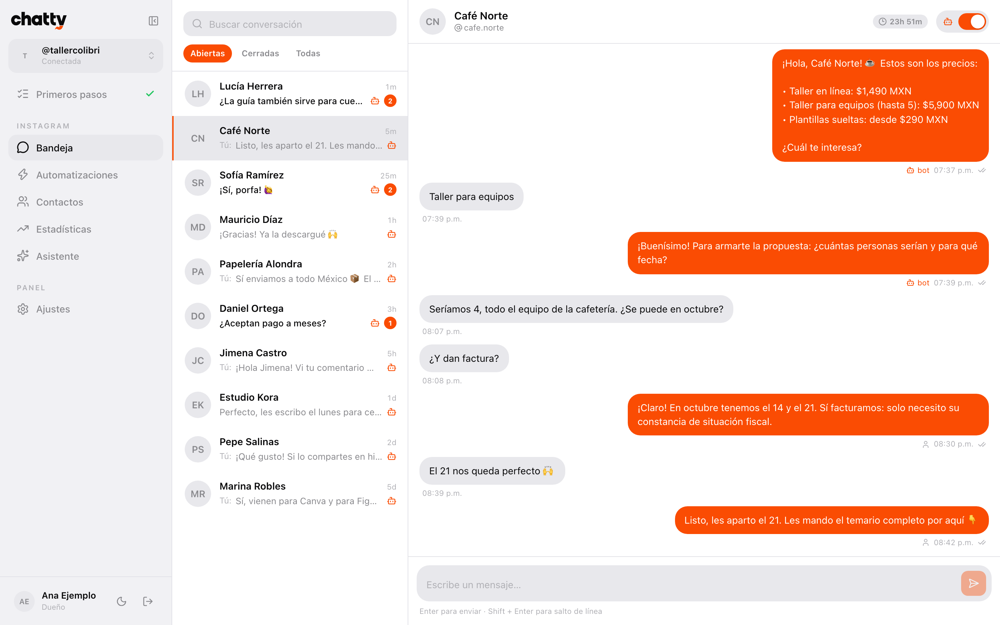
</picture>

</div>

## Why Chatty

<table>
<tr>
<td width="50%" valign="top">

**It's really yours.** Your Firebase project, your Meta app, your database. Nobody else sees your
conversations or your contacts, and there's no company in the middle that can raise your price.

</td>
<td width="50%" valign="top">

**No per-contact fees.** You only pay for the Firebase you use: for one person or a small team,
that's usually cents a month.

</td>
</tr>
<tr>
<td valign="top">

**Opens with nothing configured.** Clone it, run `npm run dev` and you see the whole system in
*guided mode*: each section shows how it looks when it's running, plus a checklist of what's
missing.

</td>
<td valign="top">

**Your brand.** Pick the panel's name, logo and color in Settings. The mobile app icon comes from
there too.

</td>
</tr>
</table>

## What it does

<table>
<tr>
<td width="50%" valign="top">

### Inbox
Every DM on your Instagram, in real time. Reply from the web or from your phone, see who came
from an ad, and take over when a flow hands the conversation to a person.

</td>
<td width="50%" valign="top">

### Automations
Keywords in DMs and in comments (the classic *"comment GUIDE and I'll DM you the link"*), story
replies, first message and a default reply. Several random public replies, priorities and
frequency limits.

</td>
</tr>
<tr>
<td colspan="2">

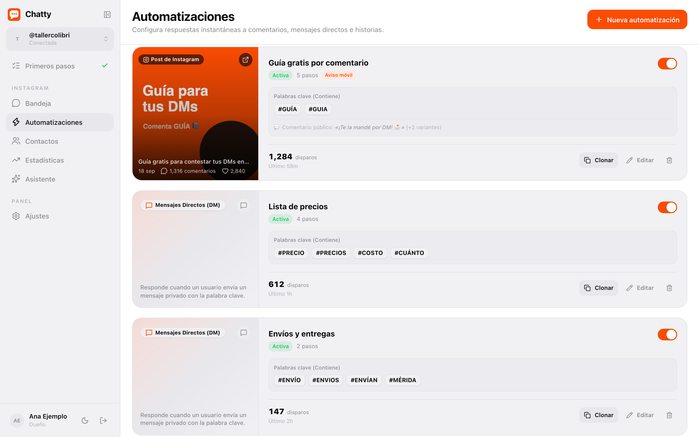

</td>
</tr>
<tr>
<td colspan="2" valign="top">

### Visual flow builder
Messages, buttons, links, quick replies, questions that save the answer, "ask them to follow
you", delays, conditions, tags, hand-off to a human and calls to your own API. Comes with a
55-node template ready to load: [«Lanzamiento de un repo»](docs/modulos/bandeja-y-automatizaciones.md#plantilla-lanzamiento-de-un-repo) (a repo launch).

<picture>
  <source media="(prefers-color-scheme: dark)" srcset="docs/imagenes/flujo-oscuro.png">
  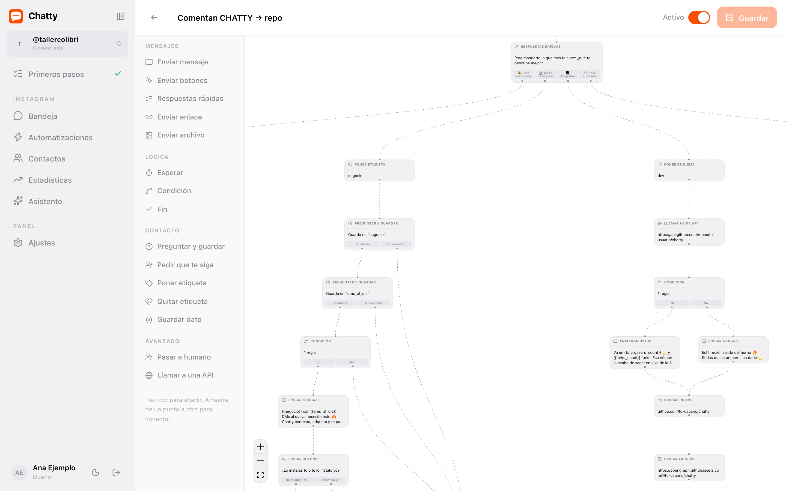
</picture>

<sub>A piece of the template. [See all 55 nodes →](docs/imagenes/flujo.png)</sub>

</td>
</tr>
<tr>
<td width="50%" valign="top">

### Contacts
Who wrote to you, their tags, your notes and everything you captured in your flows.

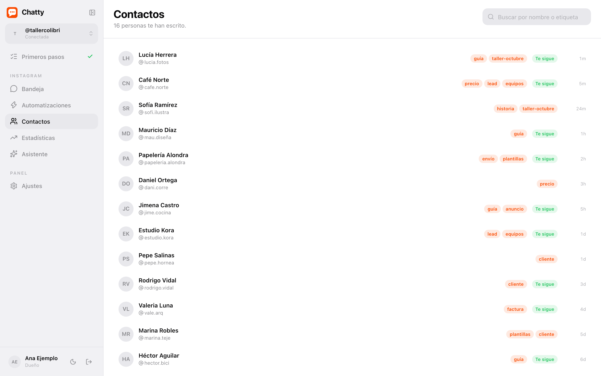

</td>
<td width="50%" valign="top">

### Analytics
Followers day by day, reach, views, your posts, your audience and what works for you. The cron
collects them because Meta doesn't keep the history.

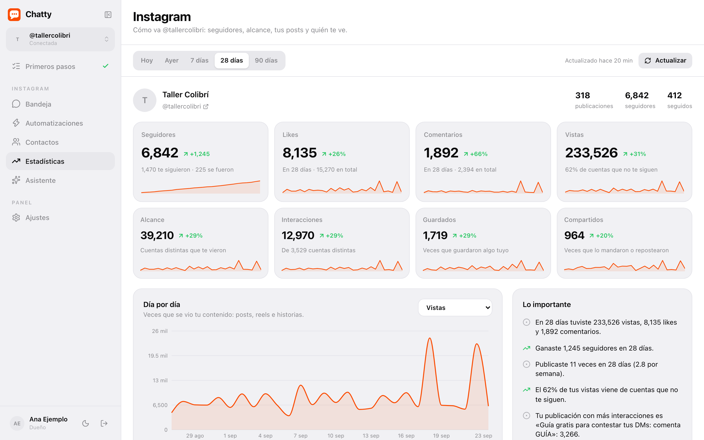

</td>
</tr>
<tr>
<td width="50%" valign="top">

### Assistant with Claude *(optional)*
*"When someone comments GUIDE on my latest post, send them this link, only if they follow me"*,
and it actually builds it in your account.

</td>
<td width="50%" valign="top">

### Your brand
Name, logo and color, with a light and dark preview. The whole panel repaints while you choose.

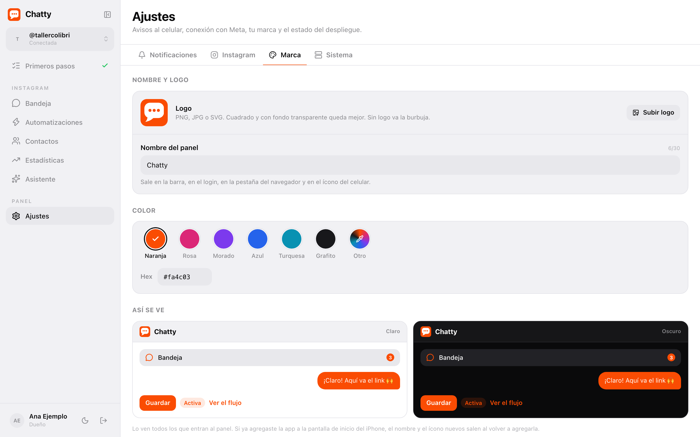

</td>
</tr>
</table>

### The mobile app

Installs from the browser (no app stores) and sends its own **push notifications**: automations
that fired, comments, unanswered DMs and milestones.

<p align="center">
  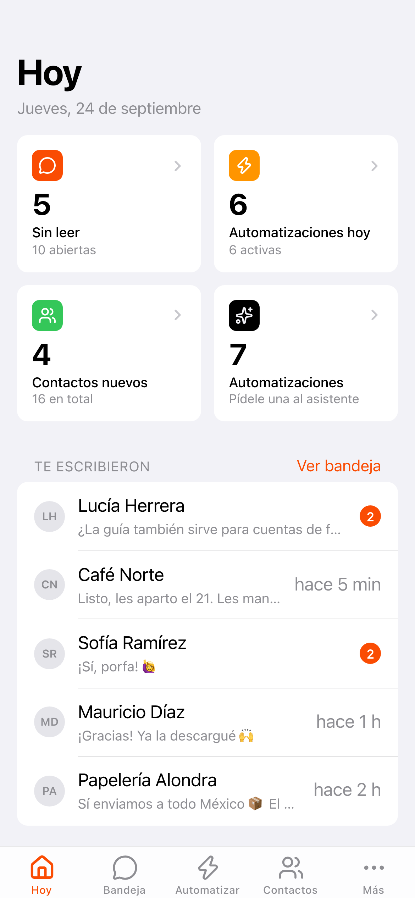
  &nbsp;
  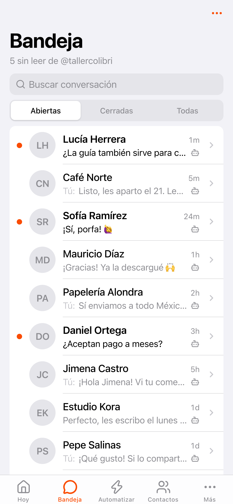
  &nbsp;
  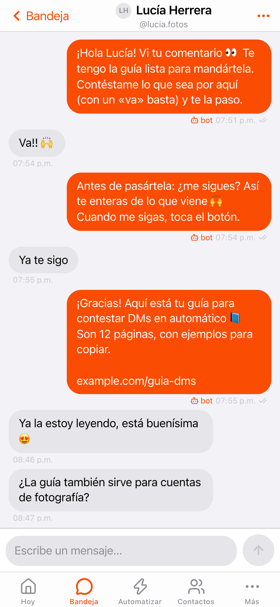
</p>

## Try it in 2 minutes

All you need is [Node.js](https://nodejs.org) 20 or newer (22 to run the tests).

```bash
git clone https://github.com/brunovareliuu/chatty.git
cd chatty/web
npm install
npm run dev
```

Open [localhost:3000](http://localhost:3000). Since it isn't connected to anything yet, it doesn't
ask you to sign in: **the system opens in guided mode**. Each section shows how it looks when it's
running and the steps it still needs, and **Primeros pasos** (Getting started) gathers everything
with its progress. What the panel can check gets ticked on its own (the variables, your connected
account, your first DM, the cron); you tick the rest. You can already set your brand in Settings.

<p align="center">
  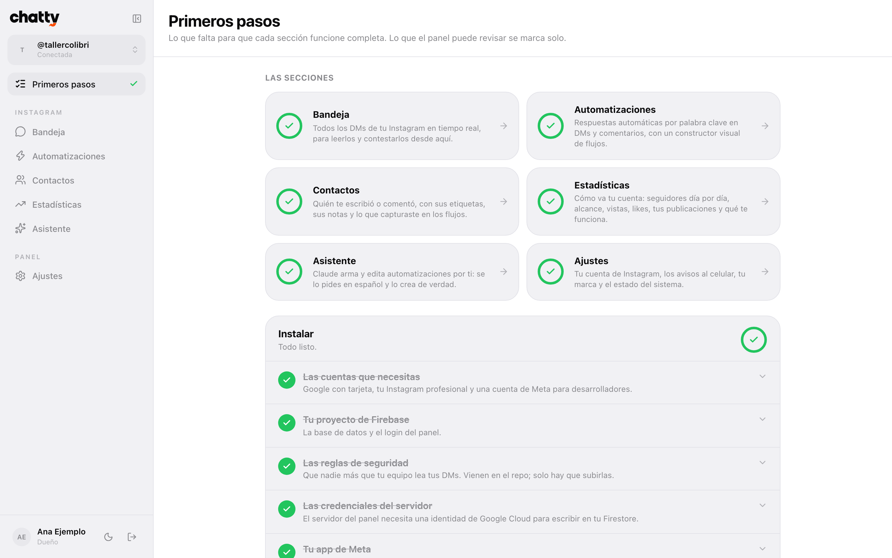
</p>

## Full setup

With everything at hand it takes one to two hours. Here's the essentials to get it running; each
step has a long guide in [`docs/`](docs/README.md) (in Spanish), with which button to click and a
"done when…" list.

### 0. What you need

| What | For | Cost |
|---|---|---|
| A Firebase project on the **Blaze plan** | App Hosting, Secret Manager and Cloud Scheduler require it | Pay as you go; with little traffic, cents |
| A **professional** Instagram account (Business or Creator) | Sending and receiving DMs, reading comments | Free |
| A [Meta for Developers](https://developers.facebook.com) account | The app that connects your Instagram | Free |
| A GitHub account | App Hosting deploys from your copy of the repo | Free |
| Node.js 20+, the [Firebase CLI](https://firebase.google.com/docs/cli) and [`gcloud`](https://cloud.google.com/sdk/docs/install) | Running and deploying it | Free |
| *Optional:* a [Claude](https://console.anthropic.com) API key | The assistant | Pay per use |

→ [Full guide: what you need](docs/01-requisitos.md)

### 1. Your copy of the repo

App Hosting deploys from **your** repository. Two ways:

- **[Use this template](https://github.com/brunovareliuu/chatty/generate)** if you want a private
  copy (recommended: that's where your configuration and your brand will live).
- **Fork it** if you want to pull updates from here with one click.

### 2. Firebase

```bash
firebase projects:create my-chatty --display-name "Chatty"
# Console → Usage and billing → switch it to the Blaze plan
firebase firestore:databases:create "(default)" --location=nam5 --project my-chatty
firebase apps:create web "Chatty" --project my-chatty
firebase apps:sdkconfig WEB --project my-chatty      # the six NEXT_PUBLIC_FIREBASE_*
```

In the console, **Authentication → Sign-in method**: enable **Google** and **Email/Password**.
Then, from the repo root, link your project and deploy the rules and indexes:

```bash
firebase use --add                # pick your project, alias "default"
firebase deploy --only firestore
```

→ [Full guide: Firebase](docs/02-firebase.md)

### 3. Meta and Instagram

1. On your Instagram: a **professional account** and, under *Messages and story replies →
   Connected tools*, **Allow access to messages**.
2. At [developers.facebook.com/apps](https://developers.facebook.com/apps): create an app with the
   **Manage messaging & content on Instagram** use case.
3. Under *API setup with Instagram login*, add the permissions `instagram_business_basic`,
   `instagram_business_manage_messages`, `instagram_business_manage_comments` and
   `instagram_business_manage_insights`.
4. Copy the **Instagram app ID** and the **Instagram app secret**.

   > ⚠️ **The most common trap:** they're different from Meta's "App ID" in Basic settings. With
   > Meta's, connecting fails with *Invalid platform app*.

5. Make up the webhook token: `openssl rand -hex 16`.
6. **App roles → Instagram Tester** → your user, and accept the invite on Instagram. That way it
   works with your account **without Meta's app review**.

The redirect URL and the webhook are finished in step 6, once you have a public URL.

→ [Full guide: Meta and Instagram](docs/03-meta-instagram.md)

### 4. Environment variables

The same names in `web/.env.local` (local) and in `web/apphosting.yaml` + Secret Manager
(production). Copy the template: `cp web/.env.example web/.env.local`.

| Variable | What it is | Secret |
|---|---|:---:|
| `NEXT_PUBLIC_FIREBASE_*` (six) | Your Firebase web app config | |
| `APP_URL` | The panel's public URL, no trailing slash | |
| `ALLOWED_EMAILS` | Who can sign in, comma-separated (empty: the first person to sign in becomes the owner) | |
| `META_APP_ID` | The **Instagram app ID** | |
| `META_APP_SECRET` | The **Instagram app secret** | 🔒 |
| `META_WEBHOOK_VERIFY_TOKEN` | The token you made up | 🔒 |
| `TOKEN_ENCRYPTION_KEY` | Encrypts the Instagram tokens (`openssl rand -hex 32`) | 🔒 |
| `CRON_SECRET` | The cron's password (`openssl rand -hex 32`) | 🔒 |
| `CLAUDE_API_KEY` | *Optional:* turns on the assistant | 🔒 |
| `NEXT_PUBLIC_BRAND_NAME`, `NEXT_PUBLIC_SITE_URL`, `NEXT_PUBLIC_TIMEZONE` | *Optional:* your business, your site and your time zone | |

While any of the six Firebase variables is missing, the panel stays in guided mode (and tells you
which ones it already has, never their value).

→ [Full guide: environment variables](docs/04-variables-de-entorno.md)

### 5. Run it locally

```bash
cd web
gcloud auth application-default login                 # server credentials
gcloud auth application-default set-quota-project my-chatty
npm run dev
```

With the variables set, the login shows up: sign in with Google using an email from
`ALLOWED_EMAILS`. To receive webhooks on your machine you need a tunnel (ngrok or cloudflared),
because Meta doesn't call `localhost`.

→ [Full guide: running locally](docs/05-correr-en-local.md)

### 6. Deploy to Firebase App Hosting

Fill in `web/apphosting.yaml` (your `APP_URL` will be `https://chatty--my-chatty.us-central1.hosted.app`
if the backend is called `chatty`), push, and create the secrets and the backend:

```bash
firebase apphosting:secrets:set META_APP_SECRET
firebase apphosting:secrets:set META_WEBHOOK_VERIFY_TOKEN
firebase apphosting:secrets:set TOKEN_ENCRYPTION_KEY
firebase apphosting:secrets:set CRON_SECRET
firebase apphosting:secrets:set CLAUDE_API_KEY        # only if you use the assistant
firebase apphosting:backends:create                   # root directory: web · branch: main
```

Once your URL responds, finish connecting:

- **Firebase → Authentication → Authorized domains:** add your `…hosted.app` domain.
- **Meta → Redirect URL:** `https://YOUR-URL/api/ig/callback`
- **Meta → Webhook:** `https://YOUR-URL/api/webhooks/instagram` with your token → *Verify and
  save* → subscribe to `messages`, `messaging_postbacks`, `messaging_seen`,
  `message_reactions`, `messaging_referral` and `comments`.

From then on, every `git push` to `main` deploys on its own.

→ [Full guide: deploying](docs/06-desplegar.md)

### 7. The cron

A heartbeat every minute that wakes up waiting flows, renews the Instagram tokens (they last 60
days) and collects the analytics:

```bash
gcloud services enable cloudscheduler.googleapis.com --project my-chatty
gcloud scheduler jobs create http chatty-tick \
  --schedule="* * * * *" \
  --uri="https://YOUR-URL/api/cron/tick" \
  --http-method=GET \
  --headers="x-cron-secret=$(gcloud secrets versions access latest --secret=CRON_SECRET --project my-chatty)" \
  --attempt-deadline=300s --location=us-central1 --project=my-chatty
```

→ [Full guide: the cron](docs/07-cron.md)

### 8. First run

1. **Ajustes → Instagram → Conectar** (Settings → Instagram → Connect) and authorize your account.
2. Send yourself a DM from another account: it should reach the **Bandeja** (Inbox) in seconds.
3. Create your first automation: *comment on a post* → keyword `GUIDE` → a DM with your link.
   Comment from another account and watch it arrive.
4. On your phone, open your URL and add it to your home screen to get the app and its
   notifications.
5. Set your brand in **Ajustes → Marca** (Settings → Brand).

When everything in **Primeros pasos** is ticked, you're done. 🎉

→ [Full guide: first run](docs/08-primer-uso.md) · [Troubleshooting](docs/solucion-de-problemas.md)

## How it's built

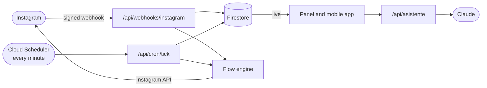

- **One deployment.** Next.js 16 (App Router) serves the screens and the endpoints on Firebase App
  Hosting. There's no separate `functions/`: the engine, the cron and the assistant live in the
  same app.
- **Live Firestore.** The browser reads with `onSnapshot`; everything sensitive is written only by
  the server, and the rules are tested against the emulator on every push.
- **Cloud Scheduler.** A heartbeat every minute for what doesn't happen because someone clicked
  something.

| Piece | Built with |
|---|---|
| Panel and API | [Next.js 16](https://nextjs.org) · React 19 · strict TypeScript |
| Styles | Tailwind CSS 4, with design tokens and dark mode |
| Data and sign-in | Firestore · Firebase Authentication · Admin SDK |
| Deployment | Firebase App Hosting (Cloud Run) · Secret Manager · Cloud Scheduler |
| Flows | [React Flow](https://reactflow.dev) |
| Charts | [Recharts](https://recharts.org) |
| Notifications | Standard Web Push (VAPID), no FCM |
| Assistant | [Claude](https://www.anthropic.com/claude), with tools |

```
chatty/
├── web/                     the app (Next.js)
│   ├── src/app/             screens and endpoints: (app) the panel, m/ the mobile app, api/
│   ├── src/lib/             the flow engine, Meta, session, notifications, analytics, the guide
│   ├── src/components/      one folder per section; ui/ is the base kit
│   └── scripts/             tests and the flow template
├── docs/                    the setup guides and one per module (in Spanish)
├── firestore.rules          who reads and writes what
└── scripts/probar-reglas.sh the rules against the emulator
```

The architecture in depth, the file map and the rules that don't break: [CLAUDE.md](CLAUDE.md)
(in Spanish).

## Limits set by Meta (not bugs)

- **24-hour window:** you can only message someone freely during the 24 h after *their* last
  message. After that, only replies from a person (`HUMAN_AGENT` tag, up to 7 days).
- **One private DM per comment**, within 7 days, **text only**. The rest of the flow waits for the
  person to reply.
- **Checking whether someone follows you** only works after they've messaged you or tapped a
  button.
- **1000 bytes** per message, **3 buttons**, **13 quick replies**.
- Tokens last **60 days**; Chatty renews them as long as the cron runs.
- To connect accounts that don't have a role in your Meta app, Meta requires **app review**.

## Security

- Without Firebase, the panel only shows guided mode: there's no data to protect. Once configured,
  everything requires a session.
- Only emails in `ALLOWED_EMAILS` can sign in, and the rules also require the server to have
  registered you: a Firebase account created outside the panel sees nothing.
- Meta tokens are stored **encrypted** (AES-256-GCM) in a path the rules deny to every browser.
- Every webhook is validated against the `X-Hub-Signature-256` signature.
- The "Call an API" node blocks internal destinations; the Claude key only lives on the server.

Found a vulnerability? Report it privately: [SECURITY.md](SECURITY.md).

## Development

```bash
cd web
npm run dev         # the panel at localhost:3000
npm run test        # 191 tests: flow engine, matcher, analytics and branding
npm run typecheck   # on a fresh clone, first: npx next typegen
npm run lint
npm run build

# from the root: the Firestore rules against the emulator (needs Java)
firebase emulators:exec --only firestore --project demo-chatty ./scripts/probar-reglas.sh
```

[CI](.github/workflows/ci.yml) runs all of that on every push and every pull request.

## FAQ

<details>
<summary><b>How much does it cost to run?</b></summary>

Firebase on the Blaze plan charges by usage. With the traffic of one person or a small team, the
bill is usually cents a month; Cloud Scheduler gives you 3 free jobs and the cron is one. The only
thing that can cost more is the assistant (Claude), which is billed separately and only if you use
it.
</details>

<details>
<summary><b>Do I need Meta to review my app?</b></summary>

No, if you only connect your own accounts: adding them as testers of your app is enough. For
other businesses to connect theirs, Meta asks for business verification and app review. The panel
already includes the public privacy policy they ask for (`/privacidad`).
</details>

<details>
<summary><b>Can I connect several Instagram accounts?</b></summary>

Yes. Each account has its own inbox, automations and contacts, and you switch between them from
the sidebar.
</details>

<details>
<summary><b>Does the AI reply to my followers?</b></summary>

No, on purpose. The assistant works for you: it builds and edits automations. What your followers
get is what you decided in your flows.
</details>

<details>
<summary><b>Is there an English interface?</b></summary>

Not yet: the panel, the mobile app and the guides are in Spanish. Automations send whatever text
you write, so your messages can be in any language.
</details>

<details>
<summary><b>Does it work with WhatsApp or Messenger?</b></summary>

No: Chatty is Instagram only.
</details>

## Contributing

Issues and pull requests are welcome. First read [CONTRIBUTING.md](CONTRIBUTING.md): the code,
comments and UI are in Spanish, no real data, and the tests must pass. For setup questions, use
[Discussions](https://github.com/brunovareliuu/chatty/discussions).

If Chatty is useful to you, leave a ⭐: it helps more people find it.

## License

[MIT](LICENSE). Use it, change it and deploy it for yourself or for your clients.

<sub>Chatty is not affiliated with Meta, Instagram or ManyChat. Instagram is a trademark of Meta
Platforms, Inc.</sub>
