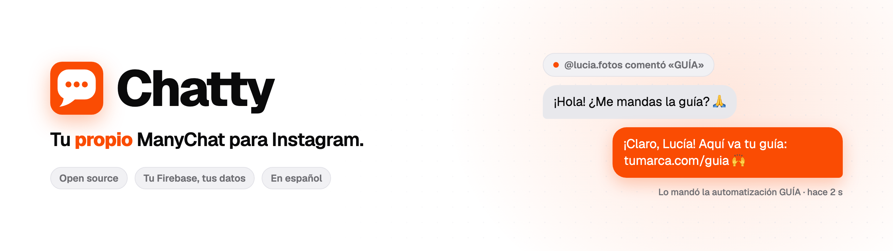
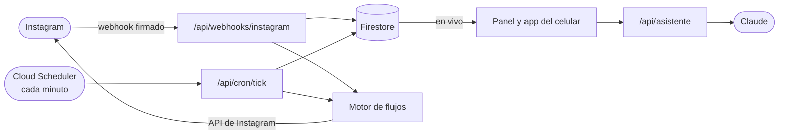

<div align="center">

<picture>
  <source media="(prefers-color-scheme: dark)" srcset="docs/imagenes/banner-oscuro.png">
  
</picture>

<br>

**La bandeja de tus DMs, automatizaciones por palabra clave, un constructor visual de flujos y las
estadísticas de tu cuenta de Instagram.**<br>
Corre en **tu** Firebase, con **tus** datos, sin suscripción. En español de punta a punta.

<br>

[](https://github.com/brunovareliuu/chatty/actions/workflows/ci.yml)
[](LICENSE)
[](https://nextjs.org)
[](https://firebase.google.com)
[](web/tsconfig.json)
[](docs/README.md)

[**Pruébalo en 2 minutos**](#pruébalo-en-2-minutos) · [Instalación completa](#instalación-completa) · [Documentación](docs/README.md) · [Cómo está hecho](#cómo-está-hecho) · [Contribuir](CONTRIBUTING.md)

<br>

<picture>
  <source media="(prefers-color-scheme: dark)" srcset="docs/imagenes/bandeja-oscuro.png">
  
</picture>

</div>

## Por qué Chatty

<table>
<tr>
<td width="50%" valign="top">

**Es tuyo de verdad.** Tu proyecto de Firebase, tu app de Meta, tu base de datos. Nadie más ve
tus conversaciones ni tus contactos, y no hay una empresa en medio que pueda cambiarte el precio.

</td>
<td width="50%" valign="top">

**No cobra por contacto.** Pagas solo lo que uses de Firebase: con el uso de una persona o de un
equipo chico, suelen ser centavos al mes.

</td>
</tr>
<tr>
<td valign="top">

**Se abre sin configurar nada.** Clonas, corres `npm run dev` y ya ves el sistema completo en
*modo guía*: cada sección con cómo se ve funcionando y el checklist de lo que le falta.

</td>
<td valign="top">

**Con tu marca.** El nombre, el logo y el color del panel se eligen en Ajustes. El ícono de la app
del celular sale de ahí.

</td>
</tr>
</table>

<p align="center">
  
</p>

## Qué hace

<table>
<tr>
<td width="50%" valign="top">

### Bandeja
Todos los DMs de tu Instagram en tiempo real. Contestas desde la web o desde el celular, ves
quién llegó por un anuncio y tomas el control cuando un flujo pasa la conversación a una persona.

</td>
<td width="50%" valign="top">

### Automatizaciones
Por palabra clave en DM, en comentarios (el clásico *«comenta GUÍA y te mando el link»*),
respuestas a historias, primer mensaje y respuesta por defecto. Varias respuestas públicas al
azar, prioridades y límites de frecuencia.

</td>
</tr>
<tr>
<td colspan="2">


</td>
</tr>
<tr>
<td colspan="2" valign="top">

### Constructor visual de flujos
Mensajes, botones, enlaces, respuestas rápidas, preguntas que guardan lo que te contestan,
«pedir que te siga», esperas, condiciones, etiquetas, pasar a humano y llamadas a tu propia API.
Trae una plantilla de 55 nodos lista para cargar: [«Lanzamiento de un repo»](docs/modulos/bandeja-y-automatizaciones.md#plantilla-lanzamiento-de-un-repo).

<picture>
  <source media="(prefers-color-scheme: dark)" srcset="docs/imagenes/flujo-oscuro.png">
  
</picture>

<sub>Un pedazo de la plantilla. [Así se ve entera, con sus 55 nodos →](docs/imagenes/flujo.png)</sub>

</td>
</tr>
<tr>
<td width="50%" valign="top">

### Contactos
Quién te escribió, sus etiquetas, sus notas y todo lo que capturaste en los flujos.


</td>
<td width="50%" valign="top">

### Estadísticas
Seguidores día por día, alcance, vistas, tus publicaciones, tu audiencia y qué te funciona. El
cron las junta porque Meta no guarda la historia.


</td>
</tr>
<tr>
<td width="50%" valign="top">

### Asistente con Claude *(opcional)*
*«Cuando comenten GUÍA en mi último post, mándales este link, solo si me siguen»*, y lo arma de
verdad en tu cuenta.

</td>
<td width="50%" valign="top">

### Tu marca
Nombre, logo y color, con vista previa en claro y en oscuro. Todo el panel se pinta mientras
eliges.


</td>
</tr>
</table>

### La app del celular

Se instala desde el navegador (sin tiendas) y manda **avisos push** propios: automatizaciones
que saltaron, comentarios, DMs sin contestar y cifras redondas.

<p align="center">
  
  &nbsp;
  
  &nbsp;
  
</p>

## Pruébalo en 2 minutos

Solo necesitas [Node.js](https://nodejs.org) 20 o más nuevo (22 para correr las pruebas).

```bash
git clone https://github.com/brunovareliuu/chatty.git
cd chatty/web
npm install
npm run dev
```

Abre [localhost:3000](http://localhost:3000). Como todavía no está conectado a nada, no pide
cuenta: se abre **el sistema en modo guía**. Cada sección enseña cómo se ve funcionando y los
pasos que le faltan, y **Primeros pasos** junta todo con su avance. Lo que el panel puede revisar
se palomea solo (las variables, tu cuenta conectada, tu primer DM, el cron); lo demás lo palomeas
tú. En Ajustes ya puedes ponerle tu marca.

<p align="center">
  
</p>

## Instalación completa

Con todo a la mano toma entre una y dos horas. Aquí va lo esencial para dejarlo funcionando; cada
paso tiene su guía larga en [`docs/`](docs/README.md), con qué botón picar y una lista de
«listo si…».

### 0. Lo que necesitas

| Qué | Para qué | Costo |
|---|---|---|
| Proyecto de Firebase en **plan Blaze** | App Hosting, Secret Manager y Cloud Scheduler lo exigen | Pago por uso; con poco tráfico, centavos |
| Instagram **profesional** (Empresa o Creador) | Recibir y mandar DMs, leer comentarios | Gratis |
| Cuenta de [Meta for Developers](https://developers.facebook.com) | La app que conecta tu Instagram | Gratis |
| Cuenta de GitHub | App Hosting despliega desde tu copia del repo | Gratis |
| Node.js 20+, [Firebase CLI](https://firebase.google.com/docs/cli) y [`gcloud`](https://cloud.google.com/sdk/docs/install) | Correrlo y desplegarlo | Gratis |
| *Opcional:* llave de [Claude](https://console.anthropic.com) | El asistente | Por uso |

→ [Guía completa: lo que necesitas](docs/01-requisitos.md)

### 1. Tu copia del repo

App Hosting despliega desde **tu** repositorio. Dos formas:

- **[Usa esta plantilla](https://github.com/brunovareliuu/chatty/generate)** si quieres tu copia
  privada (recomendado: ahí van a vivir tu configuración y tu marca).
- **Haz fork** si quieres jalar las actualizaciones de aquí con un clic.

### 2. Firebase

```bash
firebase projects:create mi-chatty --display-name "Chatty"
# Consola → Uso y facturación → cámbialo a plan Blaze
firebase firestore:databases:create "(default)" --location=nam5 --project mi-chatty
firebase apps:create web "Chatty" --project mi-chatty
firebase apps:sdkconfig WEB --project mi-chatty      # los seis NEXT_PUBLIC_FIREBASE_*
```

En la consola, **Authentication → Método de acceso**: activa **Google** y **Correo/contraseña**.
Luego, desde la raíz del repo, liga tu proyecto y sube las reglas y los índices:

```bash
firebase use --add                # elige tu proyecto, alias "default"
firebase deploy --only firestore
```

→ [Guía completa: Firebase](docs/02-firebase.md)

### 3. Meta e Instagram

1. En tu Instagram: **cuenta profesional** y, en *Mensajes y respuestas a historias →
   Herramientas conectadas*, **Permitir el acceso a los mensajes**.
2. En [developers.facebook.com/apps](https://developers.facebook.com/apps): crea una app con el
   caso de uso **Administrar mensajes y contenido en Instagram**.
3. En *Configuración de la API con inicio de sesión de Instagram*, agrega los permisos
   `instagram_business_basic`, `instagram_business_manage_messages`,
   `instagram_business_manage_comments` e `instagram_business_manage_insights`.
4. Copia el **ID** y la **clave secreta de la app de Instagram**.

   > ⚠️ **La trampa más común:** son distintos del «ID de la app» de Meta de Configuración
   > básica. Con los de Meta, conectar falla con *Invalid platform app*.

5. Inventa el token del webhook: `openssl rand -hex 16`.
6. **Roles de la app → Tester de Instagram** → tu usuario, y acepta la invitación en Instagram.
   Así funciona con tu cuenta **sin revisión de Meta**.

La URL de redireccionamiento y el webhook se terminan en el paso 6, cuando ya tienes URL pública.

→ [Guía completa: Meta e Instagram](docs/03-meta-instagram.md)

### 4. Variables de entorno

Los mismos nombres en `web/.env.local` (local) y en `web/apphosting.yaml` + Secret Manager
(producción). Copia la plantilla: `cp web/.env.example web/.env.local`.

| Variable | Qué es | Secreto |
|---|---|:---:|
| `NEXT_PUBLIC_FIREBASE_*` (seis) | La configuración de tu app web de Firebase | |
| `APP_URL` | La URL pública del panel, sin slash final | |
| `ALLOWED_EMAILS` | Quién puede entrar, separado por comas (vacía: el primero en entrar queda de dueño) | |
| `META_APP_ID` | El **ID de la app de Instagram** | |
| `META_APP_SECRET` | La **clave secreta de la app de Instagram** | 🔒 |
| `META_WEBHOOK_VERIFY_TOKEN` | El token que inventaste | 🔒 |
| `TOKEN_ENCRYPTION_KEY` | Cifra los tokens de Instagram (`openssl rand -hex 32`) | 🔒 |
| `CRON_SECRET` | La contraseña del cron (`openssl rand -hex 32`) | 🔒 |
| `CLAUDE_API_KEY` | *Opcional:* prende el asistente | 🔒 |
| `NEXT_PUBLIC_BRAND_NAME`, `NEXT_PUBLIC_SITE_URL`, `NEXT_PUBLIC_TIMEZONE` | *Opcionales:* tu negocio, tu sitio y tu zona horaria | |

Mientras falte alguna de las seis de Firebase, el panel se queda en modo guía (y te dice cuáles
ya tiene, nunca su valor).

→ [Guía completa: variables de entorno](docs/04-variables-de-entorno.md)

### 5. Correr en local

```bash
cd web
gcloud auth application-default login                 # credenciales del servidor
gcloud auth application-default set-quota-project mi-chatty
npm run dev
```

Con las variables puestas aparece el login: entra con Google con un correo de `ALLOWED_EMAILS`.
Para recibir webhooks en tu máquina hace falta un túnel (ngrok o cloudflared), porque Meta no
llama a `localhost`.

→ [Guía completa: correr en local](docs/05-correr-en-local.md)

### 6. Desplegar en Firebase App Hosting

Llena `web/apphosting.yaml` (tu `APP_URL` será `https://chatty--mi-chatty.us-central1.hosted.app`
si el backend se llama `chatty`), haz push y crea los secretos y el backend:

```bash
firebase apphosting:secrets:set META_APP_SECRET
firebase apphosting:secrets:set META_WEBHOOK_VERIFY_TOKEN
firebase apphosting:secrets:set TOKEN_ENCRYPTION_KEY
firebase apphosting:secrets:set CRON_SECRET
firebase apphosting:secrets:set CLAUDE_API_KEY        # solo si usas el asistente
firebase apphosting:backends:create                   # directorio raíz: web · rama: main
```

Cuando responda tu URL, termina de conectar:

- **Firebase → Authentication → Dominios autorizados:** agrega tu dominio `…hosted.app`.
- **Meta → URL de redireccionamiento:** `https://TU-URL/api/ig/callback`
- **Meta → Webhook:** `https://TU-URL/api/webhooks/instagram` con tu token → *Verificar y
  guardar* → suscríbete a `messages`, `messaging_postbacks`, `messaging_seen`,
  `message_reactions`, `messaging_referral` y `comments`.

Desde ahí, cada `git push` a `main` despliega solo.

→ [Guía completa: desplegar](docs/06-desplegar.md)

### 7. El cron

Un latido por minuto que despierta los flujos en espera, renueva los tokens de Instagram (duran
60 días) y junta las estadísticas:

```bash
gcloud services enable cloudscheduler.googleapis.com --project mi-chatty
gcloud scheduler jobs create http chatty-tick \
  --schedule="* * * * *" \
  --uri="https://TU-URL/api/cron/tick" \
  --http-method=GET \
  --headers="x-cron-secret=$(gcloud secrets versions access latest --secret=CRON_SECRET --project mi-chatty)" \
  --attempt-deadline=300s --location=us-central1 --project=mi-chatty
```

→ [Guía completa: el cron](docs/07-cron.md)

### 8. Primer uso

1. **Ajustes → Instagram → Conectar** y autoriza tu cuenta.
2. Mándate un DM desde otra cuenta: tiene que llegar a la **Bandeja** en segundos.
3. Crea tu primera automatización: *comentario en publicación* → palabra `GUÍA` → un DM con tu
   link. Comenta desde otra cuenta y mira cómo llega.
4. En el celular, abre tu URL y agrégala a inicio para tener la app y sus avisos.
5. Ponle tu marca en **Ajustes → Marca**.

Cuando todo lo de **Primeros pasos** está palomeado, ya quedó. 🎉

→ [Guía completa: primer uso](docs/08-primer-uso.md) · [Solución de problemas](docs/solucion-de-problemas.md)

## Cómo está hecho



- **Un solo despliegue.** Next.js 16 (App Router) sirve las pantallas y los endpoints en Firebase
  App Hosting. No hay `functions/` aparte: el motor, el cron y el asistente viven en la misma app.
- **Firestore en vivo.** El navegador lee con `onSnapshot`; todo lo sensible lo escribe solo el
  servidor, y las reglas se prueban contra el emulador en cada push.
- **Cloud Scheduler.** Un latido por minuto para lo que no ocurre porque alguien tocó algo.

| Pieza | Con qué |
|---|---|
| Panel y API | [Next.js 16](https://nextjs.org) · React 19 · TypeScript estricto |
| Estilos | Tailwind CSS 4, con tokens de diseño y modo oscuro |
| Datos y login | Firestore · Firebase Authentication · Admin SDK |
| Despliegue | Firebase App Hosting (Cloud Run) · Secret Manager · Cloud Scheduler |
| Flujos | [React Flow](https://reactflow.dev) |
| Gráficas | [Recharts](https://recharts.org) |
| Avisos | Web Push estándar (VAPID), sin FCM |
| Asistente | [Claude](https://www.anthropic.com/claude), con herramientas |

```
chatty/
├── web/                     la app (Next.js)
│   ├── src/app/             pantallas y endpoints: (app) el panel, m/ la app del celular, api/
│   ├── src/lib/             el motor de flujos, Meta, sesión, avisos, estadísticas, la guía
│   ├── src/components/      una carpeta por sección; ui/ es el kit base
│   └── scripts/             pruebas y la plantilla de flujo
├── docs/                    las guías de instalación y de cada módulo
├── firestore.rules          quién lee y escribe qué
└── scripts/probar-reglas.sh las reglas contra el emulador
```

La arquitectura a fondo, el mapa de archivos y las reglas que no se rompen: [CLAUDE.md](CLAUDE.md).

## Límites que impone Meta (no son bugs)

- **Ventana de 24 horas:** solo le escribes libremente a alguien durante las 24 h posteriores a
  *su* último mensaje. Después, solo respuestas de una persona (etiqueta `HUMAN_AGENT`, hasta 7
  días).
- **Un DM privado por comentario**, dentro de 7 días, **solo de texto**. Lo demás del flujo espera
  a que la persona conteste.
- **Saber si alguien te sigue** solo funciona después de que te escribió o tocó un botón.
- **1000 bytes** por mensaje, **3 botones**, **13 respuestas rápidas**.
- Los tokens duran **60 días**; Chatty los renueva mientras el cron corra.
- Para conectar cuentas que no tienen rol en tu app de Meta, Meta exige **revisión de la app**.

## Seguridad

- Sin Firebase, el panel solo enseña el modo guía: no hay datos que proteger. Ya configurado, todo
  pide sesión.
- Solo entran los correos de `ALLOWED_EMAILS`, y las reglas piden además que el servidor te haya
  dado de alta: una cuenta de Firebase creada por fuera no ve nada.
- Los tokens de Meta se guardan **cifrados** (AES-256-GCM) en una ruta que las reglas niegan a
  todo navegador.
- Cada webhook se valida contra la firma `X-Hub-Signature-256`.
- El nodo «Llamar a una API» bloquea destinos internos; la llave de Claude solo vive en el
  servidor.

¿Encontraste una vulnerabilidad? Repórtala en privado: [SECURITY.md](SECURITY.md).

## Desarrollo

```bash
cd web
npm run dev         # el panel en localhost:3000
npm run test        # 191 pruebas: motor de flujos, matcher, estadísticas y la marca
npm run typecheck   # en un clon nuevo, antes: npx next typegen
npm run lint
npm run build

# desde la raíz: las reglas de Firestore contra el emulador (necesita Java)
firebase emulators:exec --only firestore --project demo-chatty ./scripts/probar-reglas.sh
```

El [CI](.github/workflows/ci.yml) corre todo eso en cada push y en cada pull request.

## Preguntas frecuentes

<details>
<summary><b>¿Cuánto cuesta tenerlo funcionando?</b></summary>

Firebase en plan Blaze cobra por uso. Con el tráfico de una persona o un equipo chico, la cuenta
suele ser de centavos al mes; Cloud Scheduler da 3 jobs gratis y el cron es uno. Lo único que
puede costar más es el asistente (Claude), que se paga aparte y solo si lo usas.
</details>

<details>
<summary><b>¿Necesito que Meta revise mi app?</b></summary>

No, si solo conectas tus propias cuentas: basta con agregarlas como testers de tu app. Para que
otros negocios conecten la suya, Meta pide verificación del negocio y revisión de la app. El
panel ya trae la política de privacidad pública que te piden (`/privacidad`).
</details>

<details>
<summary><b>¿Puedo conectar varias cuentas de Instagram?</b></summary>

Sí. Cada cuenta tiene su bandeja, sus automatizaciones y sus contactos, y cambias entre ellas
desde la barra lateral.
</details>

<details>
<summary><b>¿La IA le contesta a mis seguidores?</b></summary>

No, a propósito. El asistente trabaja para ti: arma y edita automatizaciones. Lo que les llega a
tus seguidores es lo que tú decidiste en tus flujos.
</details>

<details>
<summary><b>¿Funciona con WhatsApp o Messenger?</b></summary>

No: Chatty es solo para Instagram.
</details>

## Contribuir

Los issues y los pull requests son bienvenidos. Antes, lee [CONTRIBUTING.md](CONTRIBUTING.md):
todo va en español, sin datos reales y con las pruebas pasando. Para dudas de instalación, usa
[Discussions](https://github.com/brunovareliuu/chatty/discussions).

Si Chatty te sirve, deja una ⭐: ayuda a que más gente lo encuentre.

## Licencia

[MIT](LICENSE). Úsalo, cámbialo y despliégalo para ti o para tus clientes.

<sub>Chatty no está afiliado a Meta, Instagram ni ManyChat. Instagram es una marca de Meta
Platforms, Inc.</sub>
